# Zyncx Protocol: Privacy-Preserving DeFi on Solana

> **A comprehensive guide to what Zyncx hides, how it works, and its limitations**

---

## Table of Contents

1. [Executive Summary](#executive-summary)
2. [What Zyncx Hides](#what-zyncx-hides)
3. [What Zyncx Does NOT Hide](#what-zyncx-does-not-hide)
4. [How Privacy Works](#how-privacy-works)
5. [Technical Architecture](#technical-architecture)
6. [File Structure & Components](#file-structure--components)
7. [User Flows](#user-flows)
8. [Limitations & Known Trade-offs](#limitations--known-trade-offs)
9. [Security Considerations](#security-considerations)
10. [Comparison with Other Privacy Protocols](#comparison-with-other-privacy-protocols)

---

## Executive Summary

Zyncx is a privacy-preserving DeFi protocol on Solana that combines:

| Technology | Purpose |
|------------|---------|
| **Noir ZK Circuits** | Prove ownership without revealing which deposit is yours |
| **Arcium MXE** | Execute trading logic in encrypted Multi-Party Computation |
| **Poseidon Hashes** | Efficient cryptographic commitments (ZK-friendly) |
| **Merkle Trees** | Efficient membership proofs (is my deposit in the pool?) |
| **Nullifiers** | Prevent double-spending without revealing identity |

**The core privacy guarantee:** Once funds enter the shielded pool, all operations (swaps, balance changes, partial withdrawals) are hidden from observers until final withdrawal.

---

## What Zyncx Hides

### ✅ Fully Hidden

| What's Hidden | How It's Hidden | Who Can't See It |
|---------------|-----------------|------------------|
| **Withdrawal-to-Deposit Link** | ZK proofs only reveal "I own *some* deposit" without revealing which one | Everyone |
| **Trading Strategy** | Executed inside Arcium MXE encrypted enclave | Everyone (including Arcium nodes) |
| **Swap Parameters** | Min/max bounds, slippage tolerance encrypted | Validators, MEV bots |
| **Internal Balance Changes** | All state changes happen in encrypted memory | Everyone |
| **Number of Operations** | Multiple swaps between deposit and withdrawal are invisible | Everyone |
| **Partial Withdrawal Pattern** | Each partial withdrawal creates fresh commitment | Blockchain observers |

### 🔐 How Link Breaking Works

```
DEPOSIT PHASE:
  User deposits 10 SOL → Commitment A inserted into Merkle tree
  Commitment A = Poseidon(secret_A, nullifier_secret_A, 10 SOL)
  
  On-chain: "Someone deposited 10 SOL" (amount visible)
  Hidden: secret_A, nullifier_secret_A

INTERNAL OPERATIONS (inside Arcium MXE):
  Swap 5 SOL → USDC → SOL (arbitrage)
  Balance changes: 10 SOL → 12 SOL
  
  On-chain: Nothing visible!
  All computation in encrypted MPC

WITHDRAWAL PHASE:
  User generates ZK proof:
    "I know secret_A and nullifier_secret_A for SOME commitment in the tree
     that has sufficient balance for this withdrawal"
  
  Proof reveals: nullifier_hash, withdraw_amount, new_commitment (for change)
  Proof HIDES: which commitment, what the original secret was
  
  On-chain: "Someone withdrew 5 SOL" (amount visible)
  Hidden: Which deposit this came from
```

---

## What Zyncx Does NOT Hide

### ❌ Visible On-Chain (Fundamental L1 Limitations)

| What's Visible | Why It's Visible | Mitigation Strategy |
|----------------|------------------|---------------------|
| **Deposit Amount** | SOL transfer requires amount in transaction | Use multiple deposits of common amounts |
| **Withdrawal Amount** | SOL transfer requires amount in transaction | Use multiple partial withdrawals |
| **Deposit Timestamp** | Block timestamp is public | Wait variable times before withdrawing |
| **Withdrawal Timestamp** | Block timestamp is public | Use relayers, random delays |
| **Gas Fee Patterns** | Transaction metadata is public | Batch with other users |

### Why Can't We Hide Amounts?

Solana (and all L1 blockchains) require explicit amounts in transfer instructions:

```rust
// This is unavoidable - SOL transfers need explicit amounts
system_program::transfer(
    CpiContext::new(/* ... */),
    amount,  // ← Visible in transaction
)?;
```

**The fix:** Homomorphic encryption would allow encrypted amounts, but:
- Solana doesn't support FHE natively
- Computation costs would be prohibitive
- Arcium provides compute privacy, not L1 transaction privacy

---

## How Privacy Works

### 1. Commitment Scheme

Every deposit creates a **commitment** that hides the deposit details:

```
commitment = Poseidon(secret, nullifier_secret, amount, token_mint)
```

| Component | Description | Privacy Role |
|-----------|-------------|---------------|
| `secret` | Random 256-bit value | Proves ownership |
| `nullifier_secret` | Random 256-bit value | Prevents double-spend |
| `amount` | Deposit amount in lamports | Binds value to commitment |
| `token_mint` | Token mint address (32 bytes) | **NEW**: Binds to specific vault |

The commitment is inserted into the on-chain Merkle tree **for that token's vault**. Each token (SOL, USDC, etc.) has its own vault with a separate Merkle tree.

**Why include token_mint?**
- Prevents cross-vault attacks (can't use SOL proof to withdraw USDC)
- Enables cross-token swaps with separate nullification and commitment

### 2. Merkle Tree Membership

To withdraw, you prove your commitment is in the tree WITHOUT revealing which leaf:

```
                    ROOT (public)
                   /            \
                 H1              H2
                /  \            /  \
              H3    H4        H5    H6
             / \   / \       / \   / \
            L0 L1 L2 L3    L4 L5 L6 L7  (your leaf is one of these)
```

The ZK proof shows: "I know a path from SOME leaf to this root" without revealing which leaf.

### 3. Nullifier System

The nullifier prevents spending the same deposit twice:

```
nullifier_hash = Poseidon(nullifier_secret)
```

- When you withdraw, you reveal `nullifier_hash`
- The contract stores it in a PDA (Program Derived Address)
- If you try to withdraw again with the same commitment, the nullifier already exists → rejected

**Privacy property:** Seeing two nullifier_hashes tells you nothing about whether they came from the same depositor.

### 4. Partial Withdrawals

Zyncx supports withdrawing part of your balance:

```
BEFORE: Commitment A = Poseidon(secret_A, null_A, 10 SOL, SOL_MINT)

WITHDRAW 3 SOL:
  - Reveal: nullifier_hash_A (marks commitment A as spent)
  - Receive: 3 SOL
  - Create: Commitment B = Poseidon(secret_B, null_B, 7 SOL, SOL_MINT)  ← NEW secrets!
  
AFTER: Commitment A is spent, Commitment B is live with 7 SOL
```

The ZK circuit verifies:
1. You know the secrets for commitment A
2. Commitment A has at least 3 SOL
3. The new commitment B is correctly formed with (original - withdrawal) amount
4. **Token mint matches** (commitment stays in same vault)

### 5. Cross-Token Swaps (NEW)

Zyncx supports swapping between different tokens while maintaining privacy:

```
BEFORE: 
  SOL Vault: Commitment A = Poseidon(secret_A, null_A, 10 SOL, SOL_MINT)
  USDC Vault: Empty

SWAP 10 SOL → 1000 USDC via Jupiter:
  - Generate ZK proof using swap_circuit()
  - Reveal: src_nullifier_hash (marks SOL commitment as spent)
  - Execute: Jupiter swap (10 SOL → 1000 USDC)
  - Create: Commitment B = Poseidon(secret_B, null_B, 1000 USDC, USDC_MINT)
  - Insert: Commitment B into USDC vault's Merkle tree
  
AFTER:
  SOL Vault: Commitment A is nullified
  USDC Vault: Commitment B is live with 1000 USDC
```

**Key insight:** The swap_circuit proves:
1. User owns source commitment (SOL)
2. Destination commitment is correctly formed (USDC)
3. Slippage protection is satisfied (`dst_amount >= min_dst_amount`)

**Privacy preserved:**
- No link between SOL deposit and USDC withdrawal
- Swap parameters (slippage) are private in the ZK proof
- Only nullifier and new commitment are revealed publicly

### 6. Arcium MXE (Multi-Party Computation) - PENDING

> **Note:** Arcium SDK integration is temporarily paused due to compatibility issues.
> The architecture is designed and code exists in `arcium_mxe.rs`, but it's disabled
> until the SDK stabilizes.

When enabled, trading logic will run inside Arcium's encrypted execution environment:

```
USER → Encrypted Inputs → [ARCIUM MXE] → Encrypted Outputs → USER
                              ↓
                     (Computation happens here)
                     (No single node sees plaintext)
                     (Only threshold of nodes together)
                     (Even they don't see your data)
```

**What runs inside MXE:**
- Balance checking (do you have enough?)
- Swap bound verification (is min_out met?)
- Slippage calculations
- Fee computations

**What Arcium nodes see:** Encrypted blobs. Even with collusion, they only see that "some computation happened."

---

## Technical Architecture

### System Components

```
┌──────────────────────────────────────────────────────────────────────┐
│                           ZYNCX PROTOCOL                             │
├──────────────────────────────────────────────────────────────────────┤
│                                                                      │
│  ┌─────────────────┐     ┌─────────────────┐     ┌────────────────┐ │
│  │   USER CLIENT   │────▶│  SOLANA PROGRAM │────▶│  ARCIUM MXE    │ │
│  │  (SDK/Frontend) │◀────│    (Anchor)     │◀────│  (Encrypted)   │ │
│  └─────────────────┘     └─────────────────┘     └────────────────┘ │
│          │                       │                       │          │
│          │                       │                       │          │
│          ▼                       ▼                       ▼          │
│  ┌─────────────────┐     ┌─────────────────┐     ┌────────────────┐ │
│  │  NOIR CIRCUIT   │     │  MERKLE TREE    │     │  ENCRYPTED     │ │
│  │  (ZK Proofs)    │     │  (On-Chain)     │     │  VAULT STATE   │ │
│  └─────────────────┘     └─────────────────┘     └────────────────┘ │
│                                                                      │
└──────────────────────────────────────────────────────────────────────┘
```

### Data Flow

```
1. DEPOSIT
   User ──(amount, precommitment)──▶ Solana Program
                                          │
                                          ├──▶ Insert commitment into Merkle tree
                                          ├──▶ Transfer SOL to vault
                                          └──▶ Emit event (amount visible)

2. CONFIDENTIAL SWAP (Inside Arcium)
   User ──(encrypted params)──▶ Queue Computation ──▶ Arcium MXE
                                                          │
                                                          ├──▶ Decrypt in secure enclave
                                                          ├──▶ Execute swap logic
                                                          ├──▶ Re-encrypt results
                                                          └──▶ Callback to Solana

3. WITHDRAWAL
   User ──(ZK proof, nullifier, amount)──▶ Solana Program
                                                │
                                                ├──▶ Verify ZK proof (Sunspot CPI)
                                                ├──▶ Check nullifier not spent
                                                ├──▶ Insert new_commitment (if partial)
                                                ├──▶ Transfer SOL to user
                                                └──▶ Mark nullifier as spent
```

---

## File Structure & Components

### Directory Overview

```
zyncx/
├── contracts/solana/zyncx/    # Anchor smart contract
│   └── src/
│       ├── lib.rs             # Program entry point
│       ├── instructions/      # Transaction handlers
│       ├── state/             # On-chain account structures
│       ├── dex/               # Jupiter DEX integration
│       └── errors/            # Custom error types
├── mixer/                     # Noir ZK circuits
│   └── src/
│       └── main.nr            # Withdrawal proof circuit
├── app/                       # Next.js frontend
└── encrypted-ixs/             # Arcium Arcis circuits (MPC logic)
```

### Detailed File Reference

#### Solana Program (`contracts/solana/zyncx/src/`)

| File | Purpose | Key Functions |
|------|---------|---------------|
| [lib.rs](contracts/solana/zyncx/src/lib.rs) | Program entry, instruction routing | `deposit_native`, `withdraw_native`, `queue_confidential_swap_mxe` |
| [instructions/initialize.rs](contracts/solana/zyncx/src/instructions/initialize.rs) | Vault setup | Creates vault PDA, Merkle tree account |
| [instructions/deposit.rs](contracts/solana/zyncx/src/instructions/deposit.rs) | Handle deposits | Transfers SOL, inserts commitment |
| [instructions/withdraw.rs](contracts/solana/zyncx/src/instructions/withdraw.rs) | Handle withdrawals | Verifies proof, checks nullifier, sends SOL |
| [instructions/swap.rs](contracts/solana/zyncx/src/instructions/swap.rs) | DEX swaps | Jupiter CPI calls |
| [instructions/verify.rs](contracts/solana/zyncx/src/instructions/verify.rs) | Merkle utilities | `check_root_exists` for root history |
| [instructions/arcium_mxe.rs](contracts/solana/zyncx/src/instructions/arcium_mxe.rs) | MXE integration | Queue computations, handle callbacks |
| [instructions/confidential.rs](contracts/solana/zyncx/src/instructions/confidential.rs) | Confidential ops | Legacy Arcium API support |
| [state/vault.rs](contracts/solana/zyncx/src/state/vault.rs) | Vault state | Total deposits, asset mint |
| [state/merkle_tree.rs](contracts/solana/zyncx/src/state/merkle_tree.rs) | Merkle tree | Leaves, root history, insert logic |
| [state/nullifier.rs](contracts/solana/zyncx/src/state/nullifier.rs) | Nullifier PDA | Prevents double-spending |
| [state/arcium_mxe.rs](contracts/solana/zyncx/src/state/arcium_mxe.rs) | MXE state | Encrypted vault, computation defs |
| [state/pyth.rs](contracts/solana/zyncx/src/state/pyth.rs) | Oracle integration | Price feed structures |
| [dex/jupiter.rs](contracts/solana/zyncx/src/dex/jupiter.rs) | Jupiter SDK | Swap routing, CPI |
| [errors/mod.rs](contracts/solana/zyncx/src/errors/mod.rs) | Custom errors | `InvalidZKProof`, `NullifierAlreadyUsed`, etc. |

#### Noir Circuit (`mixer/src/`)

| File | Purpose | Key Logic |
|------|---------|-----------|
| [main.nr](mixer/src/main.nr) | ZK withdrawal proof | Merkle membership, nullifier derivation, partial withdrawal support |

**Circuit Inputs/Outputs:**

```noir
// PRIVATE (prover knows, verifier doesn't see)
secret: Field                      // Original deposit secret
nullifier_secret: Field            // Original nullifier secret
original_amount: Field             // Full commitment amount
token_mint: Field                  // Token mint address (NEW)
merkle_path: [Field; 20]           // Sibling hashes
path_indices: [Field; 20]          // Left/right indicators
new_secret: Field                  // Fresh secret for change
new_nullifier_secret: Field        // Fresh nullifier for change

// PUBLIC (verified on-chain)
root: Field                        // Merkle tree root
nullifier_hash: Field              // Marks old commitment spent
recipient: Field                   // Withdrawal recipient
withdraw_amount: Field             // Amount being withdrawn
new_commitment: Field              // Change commitment (or 0)
token_mint_public: Field           // Must match private token_mint (NEW)
```

**Cross-Token Swap Circuit (NEW):**
```noir
fn swap_circuit(
    // Source commitment (being spent)
    src_secret, src_nullifier_secret, src_amount, src_token_mint,
    merkle_path, path_indices,
    // Destination commitment (being created)
    dst_secret, dst_nullifier_secret, dst_amount,
    // Public inputs
    src_root, src_nullifier_hash,
    src_token_mint_public, dst_token_mint_public,
    dst_commitment, min_dst_amount,
)
```

This circuit enables **SOL → USDC** swaps by:
1. Nullifying the source commitment in the SOL vault
2. Creating a new commitment in the USDC vault
3. Enforcing slippage protection (`dst_amount >= min_dst_amount`)

#### Frontend (`app/`)

| File | Purpose |
|------|---------|
| [app/page.tsx](app/app/page.tsx) | Landing page |
| [components/HeroSection.tsx](app/components/HeroSection.tsx) | Hero UI |
| [components/PrivacyVault.tsx](app/components/PrivacyVault.tsx) | Deposit/withdraw interface |
| [components/WalletProvider.tsx](app/components/WalletProvider.tsx) | Solana wallet adapter |

---

## User Flows

### Flow 1: Private Deposit


### Flow 2: Confidential Swap

```mermaid
sequenceDiagram
    participant U as User
    participant SDK as Client SDK
    participant P as Solana Program
    participant MXE as Arcium MXE

    U->>SDK: swap(SOL→USDC, min_out=95 USDC)
    SDK->>SDK: Encrypt parameters with MXE pubkey
    SDK->>P: queue_confidential_swap_mxe(encrypted_params)
    P->>MXE: Forward encrypted request
    MXE->>MXE: Decrypt in secure enclave
    MXE->>MXE: Validate swap bounds
    MXE->>MXE: Execute swap logic
    MXE->>P: Callback with encrypted result
    P->>P: Update encrypted vault state
    P-->>SDK: Swap complete
    SDK-->>U: Display result
```



### Flow 3: Partial Withdrawal


---

## Limitations & Known Trade-offs

### Fundamental Limitations

| Limitation | Cause | Impact | Mitigation |
|------------|-------|--------|------------|
| **Visible deposit amounts** | L1 transaction transparency | Observers know how much you deposited | Use standard amounts (1, 10, 100 SOL) |
| **Visible withdrawal amounts** | L1 transaction transparency | Observers know how much you withdrew | Multiple partial withdrawals |
| **Timing correlation** | Blockchain timestamps | Deposit at T1, withdraw at T2 → possible link | Wait random periods |
| **Gas patterns** | Transaction metadata | Repeated patterns can be fingerprinted | Use relayers |
| **Anonymity set size** | Number of other deposits | Few deposits = easier correlation | Protocol adoption |

### Protocol-Specific Limitations

| Limitation | Description |
|------------|-------------|
| **Merkle tree capacity** | 2^20 (~1M) commitments per vault |
| **Root history** | Only last 30 roots stored; old roots expire |
| **Computation timeout** | Arcium computations expire after configured timeout |
| **Single asset per vault** | Each vault handles one asset type |

### What an Adversary Can Learn

| Attack Vector | What They See | What They Can't Determine |
|---------------|---------------|---------------------------|
| On-chain observation | Deposit/withdrawal amounts, timestamps | Which deposit maps to which withdrawal |
| Arcium node compromise* | Encrypted blobs | Swap parameters, balances |
| Merkle tree analysis | Tree structure, root changes | Which leaf belongs to whom |
| Transaction graph | Gas payer addresses | True owner of shielded funds |

*Requires compromising threshold of nodes AND breaking encryption

---

## Security Considerations

### Trust Assumptions

| Component | Trust Assumption | What If Violated |
|-----------|------------------|------------------|
| **Noir ZK Proofs** | Cryptographic soundness | Fake proofs could drain funds |
| **Sunspot Verifier** | Correct implementation | Invalid proofs accepted |
| **Arcium MXE** | Honest threshold of nodes | Swap params could leak (but not funds) |
| **Solana Runtime** | Correct execution | State could be corrupted |
| **Poseidon Hash** | Collision resistance | Commitment forgery |

### Operational Security for Users

1. **NEVER lose your secrets** - Without `secret` and `nullifier_secret`, funds are unrecoverable
2. **Store secrets offline** - Encrypted backup, never in browser localStorage
3. **Use fresh addresses** - Withdraw to new addresses to prevent correlation
4. **Wait before withdrawing** - Immediate withdrawal links deposit to you
5. **Use standard amounts** - 1, 10, 100 SOL instead of 7.3284 SOL

### Known Attack Vectors & Mitigations

| Attack | Description | Mitigation |
|--------|-------------|------------|
| **Front-running** | MEV bot replaces recipient | Recipient bound to proof |
| **Double-spend** | Withdraw same deposit twice | Nullifier system |
| **Replay** | Use old proof on new root | Root checked against history |
| **Timing attack** | Correlate by timestamp | User-controlled delays |
| **Dusting attack** | Send micro-deposits to track | Merge commitments in MXE |

---

## Comparison with Other Privacy Protocols

| Feature | Zyncx | Tornado Cash | Aztec | Zcash |
|---------|-------|--------------|-------|-------|
| **Blockchain** | Solana | Ethereum | Ethereum L2 | Own chain |
| **Proof System** | Noir (PLONK) | Groth16 | PLONK | Groth16 |
| **Confidential Compute** | Arcium MXE | None | Rollup | None |
| **Partial Withdrawals** | ✅ Yes | ❌ No (fixed amounts) | ✅ Yes | ✅ Yes |
| **DeFi Integration** | ✅ Yes (Jupiter) | ❌ No | ⚠️ Limited | ❌ No |
| **Trading Privacy** | ✅ Full (MPC) | N/A | ⚠️ Partial | N/A |
| **Speed** | ~400ms | ~15s | ~minutes | ~75s |

---

## Glossary

| Term | Definition |
|------|------------|
| **Commitment** | `Poseidon(secret, nullifier_secret, amount)` - hides deposit details |
| **Nullifier** | `Poseidon(nullifier_secret)` - unique ID revealed at withdrawal |
| **Merkle Path** | Sibling hashes needed to compute root from leaf |
| **Anonymity Set** | Number of deposits that could plausibly be the source of a withdrawal |
| **MXE** | Multi-Party Execution - Arcium's encrypted computation environment |
| **Arcis** | Arcium's DSL for writing MPC circuits |
| **Sunspot** | Noir verifier program deployed on Solana |
| **PDA** | Program Derived Address - deterministic Solana account |

---

## References

- [Noir Language Documentation](https://noir-lang.org/docs)
- [Arcium Developer Documentation](https://docs.arcium.com)
- [Tornado Cash Whitepaper](https://tornado.cash/Tornado.cash_whitepaper_v1.4.pdf)
- [Solana Program Library](https://spl.solana.com)
- [Poseidon Hash Function](https://www.poseidon-hash.info)
- [Jupiter Aggregator](https://station.jup.ag/docs)

---

*Last Updated: January 2025*
*Protocol Version: 0.1.0*
